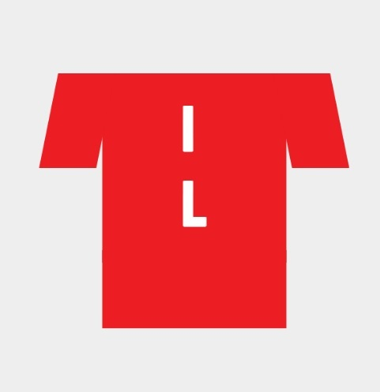
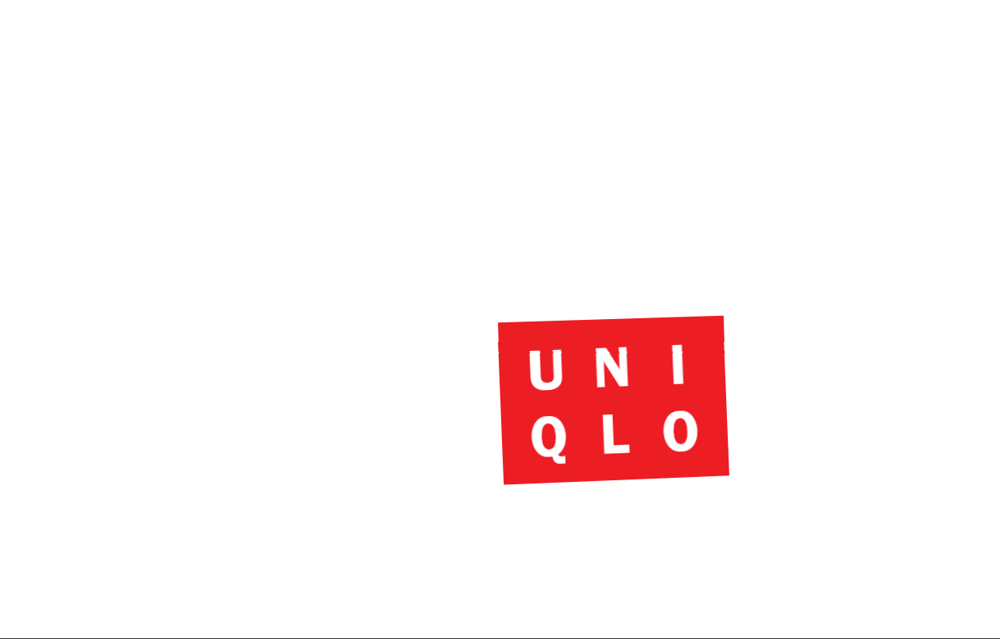

# Procesverslag
**Auteur:** Balinh Khoang

**De opdrachten:** [opdracht 1](opdracht1/index.html) en [opdracht 2](opdracht2/index.html)

Markdown is een simpele manier om HTML te schrijven.  
Markdown cheat cheet: [Hulp bij het schrijven van Markdown](https://github.com/adam-p/markdown-here/wiki/Markdown-Cheatsheet).

Nb. De standaardstructuur en de spartaanse opmaak van de README.md zijn helemaal prima. Het gaat om de inhoud van je procesverslag. Besteedt de tijd voor pracht en praal aan je website.

Nb. Door *open* toe te voegen aan een *details* element kun je deze standaard open zetten. Fijn om dat steeds voor de relevante stuk(ken) te doen.

## Bronnenlijst
  1. Font - Koulen
     https://fonts.google.com/specimen/Koulen?query=Koulen

  2. Codepen Oefeningen animeren
     https://dlo.mijnhva.nl/d2l/le/content/324295/Home
     
  3. Light - Dark mode
     https://codepen.io/ananyaneogi/pen/zXZyMP

## Opdracht 1 plan

  
uitwerken na schetsen idee (voor week 2)

  ### Je storyboard:
  

  ### Je ambitie: 
  Aan deze technieken/punten wil ik werken:
  - Met code animeren opfrissen
  - Complexere animaties maken
  - Netjes code schrijven - Een soort eigen schrijf patroon maken
  - ...
 

## Opdracht 1 reflectie

  
uitwerken bij afronden opdracht (voor week 4)

  ### Je uitkomst - karakteristiek screenshot(s):
  
  

  ### Dit ging goed/Heb ik geleerd: 
  Korte omschrijving met plaatje(s)

  
  
  Ik heb geleerd hoe je losse onderdelen kan animeren en meerdere animatie acties in 1 actie zet.
  Verder was het animeren met css even een opfrisser in wat de mogelijkheden zijn. 

  ### Dit was lastig/Is niet gelukt:
  Korte omschrijving met plaatje(s)

  
  Tijdens het maken van de animatie verplaatste de hele h1 zich zodra het bewoog. In de animatie wilde ik ook nog scale gebruiken en rotate. 

## Opdracht 2 plan

  
uitwerken na schetsen idee (voor week 5)

  ### Je ontwerp:
  

  ### Je ambitie: 
  Aan deze technieken/punten wil ik werken:
  - Javascript opfrissen
  - Meer uitgebreide code toepassen voor Javascript (Meer dan alleen basis dingen)
  - nog een punt
  - ...

## Opdracht 2 test

  
uitwerken na testen (week 7)

  Neem minimaal 5 bevindingen op:

  ### Bevinding 1:
  Omschrijving van wat er nog niet orde was (tekst en afbeeding(en)).

  #### oplossing:
  Beschrijving hoe je het hebt hebt opgelost of als het niet gelukt is hoe je het zou oplossen (tekst en afbeeding(en)).

  ### Bevinding 2:
  Omschrijving van wat er nog niet orde was (tekst en afbeeding(en)).

  #### oplossing:
  Beschrijving hoe je het hebt hebt opgelost of als het niet gelukt is hoe je het zou oplossen (tekst en afbeeding(en)).

  ### Bevinding 3:
  ...

## Opdracht 2 reflectie

  
uitwerken bij afronden opdracht (voor week 8)

  ### Je uitkomst - karakteristiek screenshot(s):
  
  

  ### Dit ging goed/Heb ik geleerd: 
  Korte omschrijving met plaatje(s)
  Het maken en ontwerpen ging best prima. Het gebruiken van libaries was nieuw voor mij en erg handig om toe te passen.
  

  ### Dit was lastig/Is niet gelukt:
  Korte omschrijving met plaatje(s)
  Wat mij niet is gelukt was het gebruiken van pijltjes om door de gallerij te navigeren en bestanden verplaatsen. Vond het erg ingewikkeld.
  Verder wou ik ook de foto's laten omdraaien en op de achterkant extra informatie toevoegen van de foto, maar dat lukte bij 1 afbeelding er vervolgens brak het de code. Ik heb hiervoor wat extra tijd nodig om uit te zoeken hoe dat precies werkt zonder mijn code te breken. 
  

